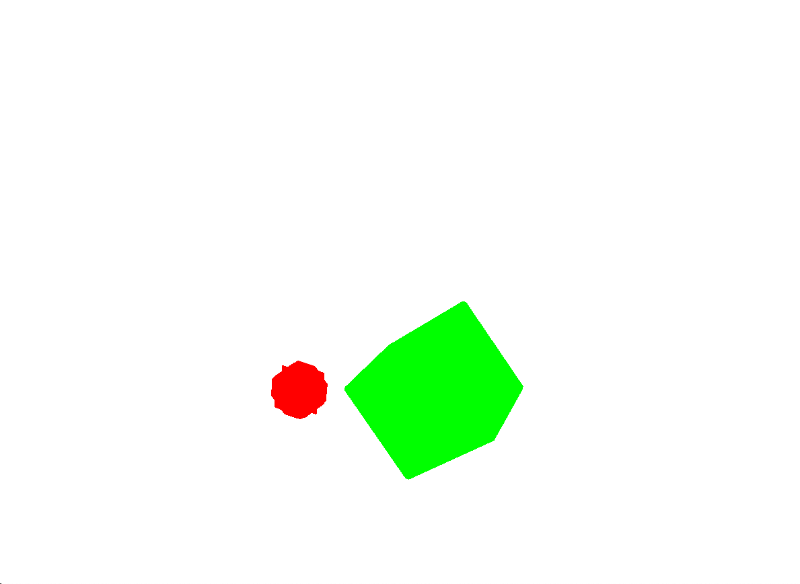

# Objective

A personal learning project for OpenGL and 3D meshing with the Marching Cubes algorithm.

# Demo

`./main.out` opens a window and shows 3D meshed sphere and square. (The binary was complied on my personal Mac; not guaranteed to work in any other machines).
Navigation:
- arrow keys move the position of the camera.
- `[` `]` rotate camera around the target horizontally.
- `=` `'` rotate camera around the target vertically.
- `j` `k` zooms into/out from the target.

# Development

`main.cpp` is the main entry point to the app.